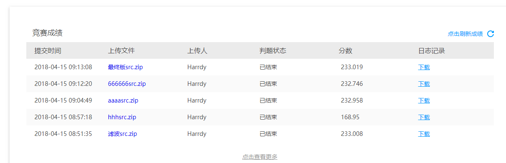

## 2018-Huawei-Code-Craft

***
### 介绍
```
华为软件精英挑战赛（Huawei Code Craft）是华为公司面向全球大学生举办的一年一度的大型软件竞赛，
致力于让参赛学生充分感受软件改变世界魅力，
展示软件设计与编程潜力，享受Coding解决问题乐趣，锻炼实战实践、与人沟通协作能力。
```

***
### 比赛要求
* Python2.7 不容许使用第三方库

***
### 比赛结果
```
最终成绩233.019分，从2018/3/7号开始到现在2018/4/16持续奋斗一个多月，效果不是很满意，江山赛区64强开外，但是从中收获了不少，
这个赛题分为预测阶段和放置阶段。预测阶段就是对时间序列进行预测分析，
这里面就包括，简单线性回归、线性平均、加权平均、一次指数平滑模型、二次指数平滑模型、三次指数平滑模型；
放置阶段就是背包问题，这里面就包括，0-1背包、完全背包、多重背包问题。
```


***
### 江山赛区初赛成绩


***
### 2018华为软挑全国各个赛区初赛64强成绩
* [成渝赛区64强初赛成绩](./results-in-china/成渝赛区64强初赛成绩.png)
* [杭夏赛区64强初赛成绩](./results-in-china/杭夏赛区64强初赛成绩.png)
* [江山赛区64强初赛成绩](./results-in-china/江山赛区64强初赛成绩.png)
* [京津东北赛区64强初赛成绩](./results-in-china/京津东北赛区64强初赛成绩.png)
* [上合赛区64强初赛成绩](./results-in-china/上合赛区64强初赛成绩.png)
* [武长赛区64强初赛成绩](./results-in-china/武长赛区64强初赛成绩.png)
* [西北赛区64强初赛成绩](./results-in-china/西北赛区64强初赛成绩.png)
* [粤港澳赛区64强初赛成绩](./results-in-china/粤港澳赛区64强初赛成绩.png)

<!--
在这一个多月的奋斗中，学到的知识非常之多，但是还是想吐槽一下华为，这个初赛结束之前的两天，由于华为重新放置了高级案例的，
规定这两天每一个团队每天只能提交5次，也就是只能提交9次，最后一次上传自己最高得分的代码，华为也是为了不让我们调参数，
但是还是有人在别的赛区开小号调参，华为官方表面上说的是检查加大查重，抄袭，开小号的行为，感觉这就是一个幌子，完全无公平可言，这就让我很难受。
-->
